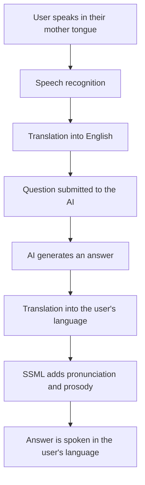
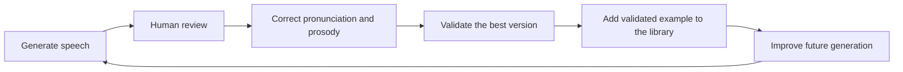
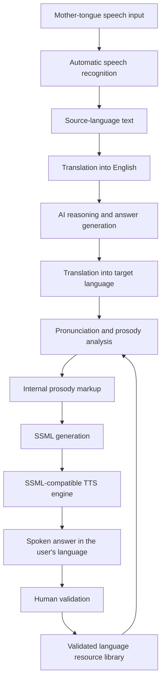

# Cross-Language TTS for Low-Resource Languages

## Overview

This project enables users to interact with artificial intelligence entirely in their **mother tongue**, even when the AI system primarily processes information in English.

A user can ask a question in their own language, have it translated into English for AI processing, and receive the answer back as natural-sounding speech in the same language.

---

## Main Benefit

A user asks a question in their mother tongue.

The system:

1. Converts the spoken question into text.
2. Translates the question into English.
3. Sends the translated question to the AI.
4. Receives the AI-generated answer in English.
5. Translates the answer into the user's language.
6. Applies pronunciation and prosody instructions using SSML.
7. Generates the final answer as spoken audio.

### Interaction Workflow



The user therefore does not need to:

- speak English;
- read English;
- type;
- or even be literate.

They can simply ask a question in the language they know best and receive a clear spoken answer in that same language.

---

## Why This Matters for Low-Resource Languages

Many advanced AI systems do not yet support low-resource languages directly or support them only partially.

Cross-language processing allows speakers of these languages to benefit from the knowledge and reasoning capabilities of English-based AI systems without being required to abandon their own language.

This approach can expand access to:

- education;
- health guidance;
- public services;
- agricultural advice;
- financial information;
- digital assistance;
- and general knowledge.

It is especially valuable for users who face language, literacy, or technology barriers.

> **The user speaks in their own language, the AI reasons through a language it understands well, and the user receives the answer as natural speech in their own language.**

---

## Role of SSML

SSML, or **Speech Synthesis Markup Language**, improves the final speech output by controlling how the translated text is spoken.

SSML can control:

- pronunciation;
- pauses;
- rhythm;
- emphasis;
- pitch;
- speaking rate;
- volume;
- and sentence phrasing.

This is important because a translation may be linguistically correct but still difficult to understand if it is pronounced incorrectly or delivered with unnatural prosody.

SSML therefore serves as the bridge between translated text and clear, intelligible, natural-sounding speech.

---

# Designing an SSML-Based Cross-Language TTS System

To design and continuously improve a cross-language text-to-speech system using an SSML-compatible TTS engine, the following components are required.

## 1. Human-Readable Pronunciation and Prosody Markup

The system should use a simple internal markup language for pronunciation and prosody.

This markup should be:

- easy for humans to read;
- easy to write and edit;
- consistent across languages;
- and straightforward to convert automatically into SSML.

The internal notation should remain independent of any specific TTS engine whenever possible.

---

## 2. Validated Library of Words, Phrases, and Sentences

The system should begin with a validated reference library containing frequently used:

- words;
- expressions;
- phrases;
- sentence types;
- and common conversational patterns.

Each entry should include validated information such as:

- pronunciation;
- syllable segmentation;
- phonemes;
- stress;
- pauses;
- pitch;
- rhythm;
- speaking rate;
- and prosody markup.

This library becomes the foundation for generating and improving new speech output.

---

## 3. Prosody Inference for New Content

The system should infer suitable pronunciation and prosody for new words, phrases, and sentences by using existing validated examples.

The inference process may consider:

- word and phrase similarity;
- sentence type;
- grammatical structure;
- punctuation;
- semantic meaning;
- emphasis;
- speaking context;
- linguistic rules;
- and previously validated prosodic patterns.

The objective is to generate appropriate:

- pronunciation;
- rhythm;
- stress;
- pitch;
- pauses;
- and speaking rate.

---

## 4. Improvement of Existing Prosody

The system should identify weak, incorrect, or unnatural pronunciation and prosodic patterns.

It should then propose improved alternatives using:

- linguistic rules;
- similarity to validated examples;
- model-based prediction;
- engine-specific testing;
- and reviewer feedback.

The system should support comparison between alternative renderings so that the most natural and intelligible version can be selected.

---

## 5. Human Validation Workflow

Native speakers or trained reviewers should be able to:

1. Listen to generated speech.
2. Review the translation.
3. Correct pronunciation.
4. Correct syllable or phoneme segmentation.
5. Adjust pauses, stress, pitch, rhythm, and speaking rate.
6. Compare alternative audio renderings.
7. Score the output.
8. Approve, reject, or revise the result.

Human validation is essential because natural pronunciation and prosody often depend on context, dialect, meaning, and cultural usage.

---

## 6. Continuous Learning

Every validated correction should be added to the reference library.

This creates a continuous improvement cycle:



Over time, the system becomes better at generating natural speech for each supported language.

---

## Core Architecture



---

## Expected Impact

An SSML-based cross-language TTS system can help make AI more accessible, inclusive, and useful for speakers of low-resource languages.

Its main value is not merely text translation. Its value is enabling a complete spoken interaction:

- the user speaks in their own language;
- the AI processes the request through a language it understands well;
- and the answer returns as intelligible, natural speech in the user's language.

This approach can help reduce both the **language divide** and the **literacy divide** in access to artificial intelligence.

---

## Collaborative Dataset Contributions

We want to make this a collaborative project where researchers, developers, language specialists, institutions, and community members can contribute datasets.

To support interoperability between systems, contributed datasets should follow the JSON exchange format below.

## Data Exchange JSON Format

```json
{
  "dataset_qualified_name": "",
  "dataset_name": "",
  "dataset_version": "",
  "dataset_schema_version": "",
  "dataset_created_by": "",
  "dataset_creation_date": "",
  "dataset_creation_notes": "",
  "records": [
    {
      "record_id": "",
      "created_date": "",
      "modified_date": "",
      "source_language_code": "",
      "source_text": "",
      "source_english_text": "",
      "target_language_code": "",
      "target_text": "",
      "syllables": [],
      "phonemes": [],
      "phoneme_alphabet": "",
      "prosody_markup": "",
      "translation_rules": [],
      "prosody_rules": [],
      "source_dataset_qualified_name": "",
      "source_dataset_name": "",
      "source_dataset_version": "",
      "source_dataset_record_id": "",
      "transformation_from_source": "",
      "ssml": "",
      "tts_engine": "",
      "tts_engine_version": "",
      "voice_name": "",
      "score": null,
      "human_validation_status": ""
    }
  ]
}
